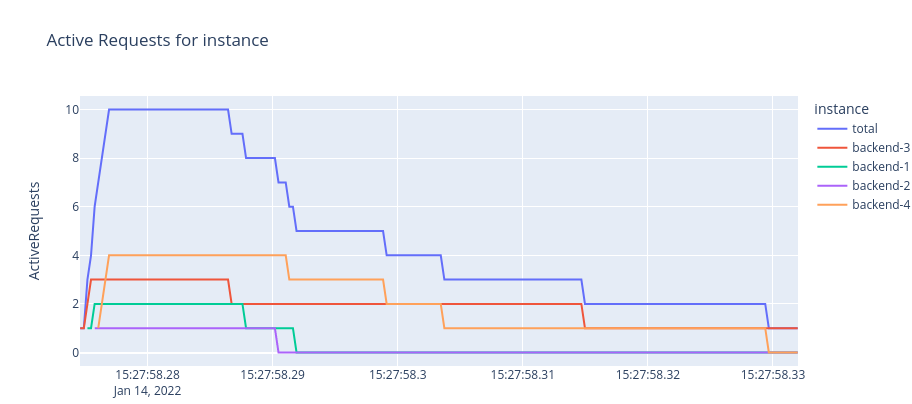

# Load Balancer Flow Visualizer

This enviroment can be used to visualize traffic flow going through load balancer. Enviroment consists of 4 parts, any of which can be easily replaced with custom one to meet requirements of the specific research:
1. Traffic flow generator.
1. Server - the server implementation which is hidden behind the load balancer.
1. Dashboard - to show charts and other visualisations after test sesision.
1. Load Balancer itself.

Services are being set up in `docker-compose.yaml`

## Services

### Client

Client code is provided in `tester.py`. In default implementation it generates N asynchronous requests to given URL of load balancer listener and records following data:
* Timestamp for the moment request was sent
* Timestamp for the moment response was received

Also client extracts some additional info from response, which will exist there if default server is used:
* Timestamp for the moment request was received by server instance
* Timestamp for the moment response was sent by server instance
* Name of server instance

### Server

Default implementation can be found in `service` folder.
Server instances receive requests routed by load balancer and respond with lognormal delay if `slow=1` option is specified in request and with no delay if not.

### Load Balancer

Load balancer service, provides an endpoint for client, routes incoming requests to server instances. 

By default Envoy Round Robin load balancer is used. Envoy configuration can be found in `envoy-balancer` folder.

### Dashboard
Dashboard loads requestts benchmarking data in json format generated by last client run from `results` folder.

Currently  charts are implemented, but it is easy to add more, taking those as examples (code can be found in `dashboard` folder):
* Request timeline chart. Timeline for which and when requests were open for each service instance.

* Number of open requests for each instance and in total by time.

* Average RPS for the system.

* Service delay - time between request was sent and response was recieved by client.

* Processing delay - time between request was sent and request processing was started by server instance.

## Usage
1. Start the containers:

` docker-compose up --build -d `

2. Send 100 requests to balancer endpoint:

`docker-compose exec -T tester python3 tester.py http://balancer:30000/bench?slow=1 100`

The `slow=1` option makes server respond with lognormal distributed delay which adds some similiarities with real endpoint load.

You can also disable some of instances using (disable instance `backend-1`):

`docker-compose exec -T tester curl -s mesh-balancer-env_backend-1_1:8000/unhealthy`

Or enable them back:

`docker-compose exec -T tester curl -s mesh-balancer-env_backend-1_1:8000/healthy`

3. Go to `http://localhost:8050`

Charts for 10 requests:

Charts for 100 requests:

